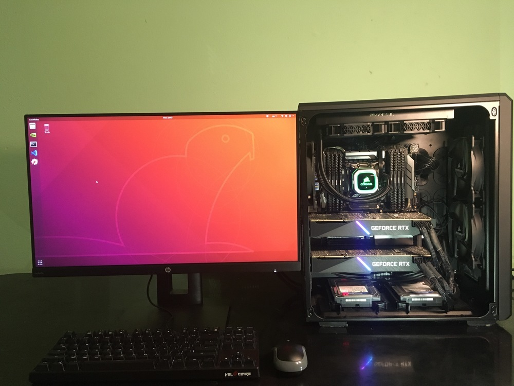

## The GPU Workstation
A personal project that I build the GPU workstation to gain hardware knowledge and use it for training and validation of deep learning models. 

Features:
- OS: Ubuntu 18.04.4 LTS
- Motherboard: Asus WS X299 Sage
- CPU: Intel® Core™ i9-9900X 10 cores 3.5 GHz
- CPU cooler: Corsair Hydro Series H100i PRO
- GPU: 2 x Asus GeForce RTX 2080 Ti 11G Turbo Edition(4352 CUDA Cores per GPU)
- RAM: 8 x Corsair Vengeance 16GB DDR4 DRAM 2666MHz
- SSD: 2TB Intel 660P NVMe M.2
- HDD: 2 x Western Digital 1TB SATA 3.5 Inch
- PSU: EVGA SuperNOVA 1600 P2
- Case: Corsair Carbide Series Air 540
- Monitor: HP VH240a

## License
Images are licensed under a Creative Commons Attribution-NonCommercial-NoDerivatives 4.0 International License.  

## References 
 - Asus motherboard user's guide
 - H100I PRO quick start guide
 - EVGA power supply user manual